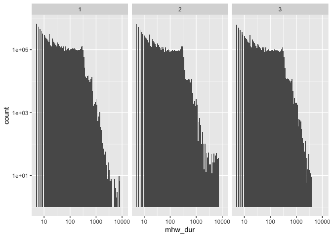
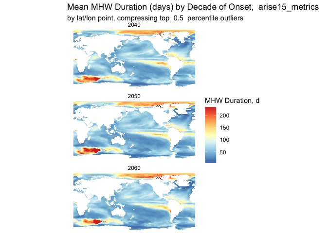

## Marine Heat Wave Climate Intervention Modelling Project

Dr. Lala Kounta, Dr. Phoebe Zarnetske

### Database connection

First set the database file to use. If there is on in the `.Renviron`
file, this will retrieve that and check that it exists.

    db_file <- mhwci::get_dbfile()

    ## Warning in mhwci::get_dbfile(): default dbfile set to
    ## /Users/billspat/tmp/mhwci.db

    print(db_file)

    ## [1] "/Users/billspat/tmp/mhwci.db"

    print(file.exists(db_file))

    ## [1] TRUE

If that is not set, set the db\_file variable here and uncomment this
line, but it may be easier to create the .Renviron file instead for your
setup.

    # db_file <- "/mnt/gs21/scratch/plz-lab/mhwci/db/mhwci.db"
    # print(file.exists(db_file))

Now that the dbfile is set, create a connection that will be used for
the remaining functions. the variable name `conn` is convention but can
be named anything.

    conn<- mhwci::mhw_connect(db_file)
    print(conn)

    ## <duckdb_connection 2a690 driver=<duckdb_driver dbdir='/Users/billspat/tmp/mhwci.db' read_only=FALSE bigint=numeric>>

### Database Contents

List of tables in current database:

    print(duckdb::dbListTables(conn))

    ## [1] "arise10_metrics"                         
    ## [2] "arise15_metrics"                         
    ## [3] "avg_duration_by_decade_arise10"          
    ## [4] "avg_duration_by_decade_truncated_arise10"
    ## [5] "decades"                                 
    ## [6] "ensembles"                               
    ## [7] "lat_index"                               
    ## [8] "lon_index"                               
    ## [9] "years"

*Sample of data in table arise10\_metrics:*

Detection modelling metrics calculated for 10 ensembles under the
Arise-1.0 scenario:

    table_head(conn = conn, tablename = "arise10_metrics", n = 10)

    ##    mhw_onset  mhw_end mhw_dur     int_max    int_mean      int_var    int_cum
    ## 1   20430806 20430810       5 0.009757260 0.008648969 0.0013323754 0.04324485
    ## 2   20470903 20470908       6 0.015895902 0.011754785 0.0035506629 0.07052871
    ## 3   20490721 20490820      31 0.011830576 0.009510951 0.0017956123 0.29483948
    ## 4   20581025 20581109      16 0.022523690 0.015844154 0.0038165624 0.25350647
    ## 5   20590127 20590201       6 1.599330517 1.408083674 0.1657496316 8.44850204
    ## 6   20610523 20610528       6 0.009532188 0.007285686 0.0012700336 0.04371412
    ## 7   20640801 20640809       9 0.009276135 0.008404164 0.0008725585 0.07563748
    ## 8   20410408 20410416       9 0.414126310 0.359418407 0.0492152531 3.23476566
    ## 9   20410929 20411006       8 0.026961171 0.021008273 0.0041988955 0.16806618
    ## 10  20430608 20430625      18 0.037464560 0.024191992 0.0067894206 0.43545585
    ##    xloc yloc ensemble  scenario mhw_onset_date mhw_end_date       lat lon
    ## 1     1   23      010 ARISE-1.0     2043-08-06   2043-08-10 -69.26702   0
    ## 2     1   23      010 ARISE-1.0     2047-09-03   2047-09-08 -69.26702   0
    ## 3     1   23      010 ARISE-1.0     2049-07-21   2049-08-20 -69.26702   0
    ## 4     1   23      010 ARISE-1.0     2058-10-25   2058-11-09 -69.26702   0
    ## 5     1   23      010 ARISE-1.0     2059-01-27   2059-02-01 -69.26702   0
    ## 6     1   23      010 ARISE-1.0     2061-05-23   2061-05-28 -69.26702   0
    ## 7     1   23      010 ARISE-1.0     2064-08-01   2064-08-09 -69.26702   0
    ## 8     1   24      010 ARISE-1.0     2041-04-08   2041-04-16 -68.32461   0
    ## 9     1   24      010 ARISE-1.0     2041-09-29   2041-10-06 -68.32461   0
    ## 10    1   24      010 ARISE-1.0     2043-06-08   2043-06-25 -68.32461   0

    decades <- table_head(conn, 'decades')
    print(decades)

    ##   decade decade_start decade_end
    ## 1   2040   2040-01-01 2049-12-31
    ## 2   2050   2050-01-01 2059-12-31
    ## 3   2060   2060-01-01 2069-12-31

### Decadal Analysis

There is a table of metrics (duration, dates, lat/long, intensity, etc)
for each scenario that contains all scenarios. This sets the table to
use.

    mhw_table <-"arise15_metrics"

*Histogram of durations by decade*

    duration_by_decade_histogram(conn, mhw_table, log_scale = TRUE)

    ## Warning in ggplot2::scale_y_log10(): log-10 transformation introduced infinite
    ## values.

    ## Warning: Removed 36 rows containing missing values or values outside the scale range
    ## (`geom_bar()`).

**Global heatwave duration by decade**

Note: we can improve on the title by selecting a single row from this
table and getting the value in the ‘scenario’ column

    duration_rasters <- durations_by_decade_raster(conn, mhw_table)
    cut_percent = 0.5
    duration_title <- paste("Mean MHW Duration (days) by Decade of Onset, ", mhw_table)

    plot_rasters_squish_outliers(raster_list = duration_rasters, title = duration_title, cut_percent = 0.5 )

In this figure, any values above 99.5 percentile are combined or
“squished” into the same color so that those huge outliers are still
present but share the same color (red). The legend still has to be
corrected to include those high value or use the “break” method but that
will take some work.

### close database connection

run this when finished so that other other connections to thie file (say
from other parts of your code) can be made.

    print(duckdb::dbDisconnect(conn))

    ## [1] TRUE
